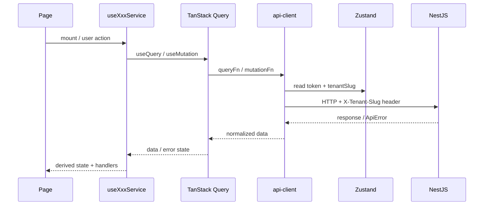
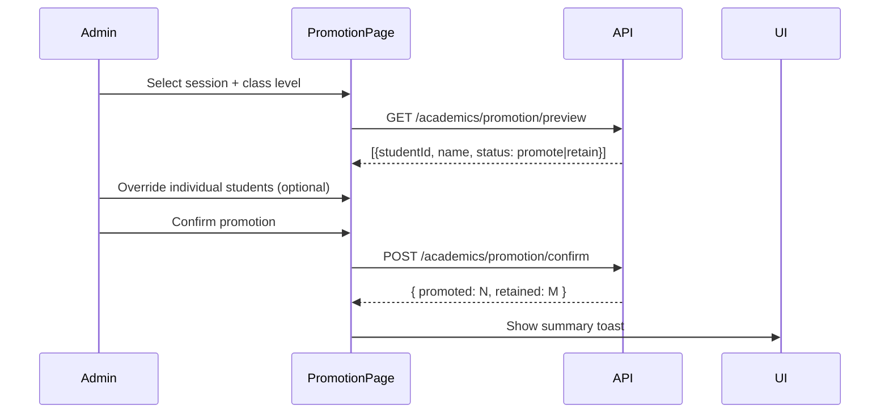
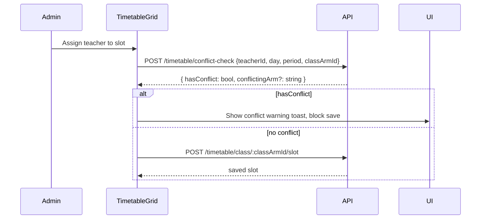

# Design Document: Learnova Advanced Features

## Overview

This document describes the technical design for the Learnova Advanced Features — a comprehensive
extension of the existing multi-tenant SaaS school management system (Next.js 16 + NestJS backend).
It covers nine capability domains that build on the API foundation and service hook patterns
established in the `learnova-frontend-completion` spec.

The nine domains are:
1. **Core Academic** — result computation engine, report card PDF, promotion/retention, class arm CRUD
2. **Finance** — fee templates, bulk invoices, payment reconciliation, discounts, expenses, financial reports
3. **Staff & HR** — subject assignments, staff attendance, payroll, leave management
4. **Communication** — automated notifications, bulk broadcast, notice board
5. **Admissions** — public portal, multi-step workflow, document management
6. **Timetable & Scheduling** — class timetable builder with conflict detection, exam timetable
7. **Parent & Student Experience** — result history, homework/assignments, absence notifications
8. **Super Admin / Platform** — onboarding wizard, usage metrics, plan limits, white-labeling
9. **Cross-Cutting** — audit trail, CSV export, academic calendar, PWA

All HTTP calls go through `lib/api-client.ts`. Query keys come from `app/constants/queryKeys.ts`.
Every module follows the service hook pattern: `app/(app)/[module]/_service/use[Module]Service.ts`.

---

## Architecture

### High-Level Module Map

```mermaid
graph TD
  subgraph "Core Academic"
    RA[Result Engine Page]
    RC[Report Card Page]
    PR[Promotion Page]
    CA[Class Arms Page]
  end

  subgraph "Finance"
    FT[Fee Templates]
    BI[Bulk Invoices]
    REC[Reconciliation]
    DIS[Discounts]
    EXP[Expenses]
    FR[Financial Reports]
  end

  subgraph "Staff & HR"
    SA[Staff Assignments]
    SAT[Staff Attendance]
    PAY[Payroll]
    LV[Leave Management]
  end

  subgraph "Communication"
    AN[Auto Notifications]
    BC[Broadcast]
    NB[Notice Board]
  end

  subgraph "Admissions"
    PP[Public Portal]
    WF[Workflow]
    DM[Document Mgmt]
  end

  subgraph "Timetable"
    TB[Timetable Builder]
    ET[Exam Timetable]
  end

  subgraph "Parent/Student"
    RH[Result History]
    HW[Homework/Assignments]
    ABN[Absence Notifications]
  end

  subgraph "Super Admin"
    OW[Onboarding Wizard]
    UM[Usage Metrics]
    PL[Plan Limits]
    WL[White-Label]
  end

  subgraph "Cross-Cutting"
    AT[Audit Trail]
    EX[CSV Export]
    AC[Academic Calendar]
    PWA[PWA/Offline]
  end

  RA --> ApiClient["lib/api-client.ts"]
  FT --> ApiClient
  SA --> ApiClient
  AN --> ApiClient
  PP --> ApiClient
  TB --> ApiClient
  RH --> ApiClient
  OW --> ApiClient
  AT --> ApiClient
  ApiClient --> Backend["NestJS Backend (multi-tenant)"]
```



### Request Lifecycle (unchanged from completion spec)



### Route Structure

```
app/
  (app)/
    academics/
      results/
        page.tsx                    ← result computation + publish
        report-cards/page.tsx       ← report card generation
        promotion/page.tsx          ← promotion workflow
      timetable/
        page.tsx                    ← class timetable builder
        exam/page.tsx               ← exam timetable
      calendar/page.tsx             ← academic calendar
    finance/
      fee-templates/page.tsx
      bulk-invoices/page.tsx
      reconciliation/page.tsx
      discounts/page.tsx
      expenses/page.tsx
      reports/page.tsx
    staff/
      assignments/page.tsx
      attendance/page.tsx
      payroll/page.tsx
      leave/page.tsx
    communications/
      broadcast/page.tsx
      notice-board/page.tsx
    admissions/
      page.tsx                      ← admin workflow view
      [id]/page.tsx                 ← application detail
    audit/page.tsx
    parent/
      results/page.tsx              ← result history
      assignments/page.tsx
    student/
      results/page.tsx
      assignments/page.tsx
  (public)/
    [tenantSlug]/
      admissions/
        apply/page.tsx              ← public application form
        track/page.tsx              ← status tracking
  super-admin/
    tenants/
      usage/page.tsx
    onboarding/page.tsx
```

---

## Components and Interfaces

### New API Endpoint Groups (`lib/api-routes.ts` additions)

```typescript
// Domain 1: Core Academic
export const RESULT_ENGINE_ENDPOINTS = {
  COMPUTE:          "/academics/results/compute",
  GET_CLASS:        "/academics/results/class",
  GET_STUDENT:      "/academics/results/student/:studentId",
  PUBLISH:          "/academics/results/publish",
  GET_REPORT_CARD:  "/academics/results/report-card/:studentId",
  DOWNLOAD_ALL:     "/academics/results/report-cards/download",
};

export const PROMOTION_ENDPOINTS = {
  PREVIEW:          "/academics/promotion/preview",
  CONFIRM:          "/academics/promotion/confirm",
  OVERRIDE:         "/academics/promotion/override",
};

// Domain 2: Finance
export const FEE_TEMPLATE_ENDPOINTS = {
  GET_ALL:          "/finance/fee-templates",
  GET_BY_ID:        "/finance/fee-templates/:id",
  CREATE:           "/finance/fee-templates",
  UPDATE:           "/finance/fee-templates/:id",
  DELETE:           "/finance/fee-templates/:id",
  BULK_GENERATE:    "/finance/fee-templates/:id/bulk-generate",
};

export const DISCOUNT_ENDPOINTS = {
  GET_ALL:          "/finance/discounts",
  CREATE:           "/finance/discounts",
  UPDATE:           "/finance/discounts/:id",
  DELETE:           "/finance/discounts/:id",
  APPLY:            "/finance/invoices/:invoiceId/discounts",
  REMOVE:           "/finance/invoices/:invoiceId/discounts/:discountId",
};

export const EXPENSE_ENDPOINTS = {
  GET_ALL:          "/finance/expenses",
  GET_BY_ID:        "/finance/expenses/:id",
  CREATE:           "/finance/expenses",
  UPDATE:           "/finance/expenses/:id",
  DELETE:           "/finance/expenses/:id",
};

export const FINANCIAL_REPORT_ENDPOINTS = {
  TERM_REVENUE:     "/finance/reports/term-revenue",
  OUTSTANDING:      "/finance/reports/outstanding-debtors",
  COLLECTION_RATE:  "/finance/reports/collection-rate",
  EXPORT_CSV:       "/finance/reports/export",
};

// Domain 3: Staff & HR
export const STAFF_ASSIGNMENT_ENDPOINTS = {
  GET_CLASS_TEACHERS:    "/staff/assignments/class-teachers",
  SET_CLASS_TEACHER:     "/staff/assignments/class-teacher",
  GET_SUBJECT_TEACHERS:  "/staff/assignments/subject-teachers",
  SET_SUBJECT_TEACHER:   "/staff/assignments/subject-teacher",
  DELETE_SUBJECT_TEACHER:"/staff/assignments/subject-teacher/:id",
};

export const STAFF_ATTENDANCE_ENDPOINTS = {
  GET_BY_DATE:      "/staff/attendance",
  SAVE:             "/staff/attendance",
  GET_MONTHLY:      "/staff/attendance/monthly",
};

export const PAYROLL_ENDPOINTS = {
  GET_ALL:          "/staff/payroll",
  GET_BY_ID:        "/staff/payroll/:id",
  CREATE:           "/staff/payroll",
  UPDATE:           "/staff/payroll/:id",
  MARK_PAID:        "/staff/payroll/:id/mark-paid",
  GET_MONTHLY_SUMMARY: "/staff/payroll/summary",
};

export const LEAVE_ENDPOINTS = {
  GET_ALL:          "/staff/leave",
  GET_BY_ID:        "/staff/leave/:id",
  CREATE:           "/staff/leave",
  APPROVE:          "/staff/leave/:id/approve",
  REJECT:           "/staff/leave/:id/reject",
  GET_BALANCES:     "/staff/leave/balances",
};

// Domain 4: Communication
export const BROADCAST_ENDPOINTS = {
  PREVIEW_RECIPIENTS: "/communications/broadcast/preview",
  SEND:               "/communications/broadcast",
  GET_HISTORY:        "/communications/broadcast/history",
};

export const NOTICE_BOARD_ENDPOINTS = {
  GET_ALL:          "/communications/notices",
  GET_BY_ID:        "/communications/notices/:id",
  CREATE:           "/communications/notices",
  UPDATE:           "/communications/notices/:id",
  DELETE:           "/communications/notices/:id",
  PIN:              "/communications/notices/:id/pin",
  UNPIN:            "/communications/notices/:id/unpin",
};

// Domain 5: Admissions
export const ADMISSIONS_EXTENDED_ENDPOINTS = {
  PUBLIC_SUBMIT:    "/public/:tenantSlug/admissions",
  PUBLIC_TRACK:     "/public/:tenantSlug/admissions/track",
  GET_ALL:          "/admissions",
  GET_BY_ID:        "/admissions/:id",
  UPDATE_STATUS:    "/admissions/:id/status",
  UPLOAD_DOCUMENT:  "/admissions/:id/documents",
  DELETE_DOCUMENT:  "/admissions/:id/documents/:docId",
  ENROLL:           "/admissions/:id/enroll",
};

// Domain 6: Timetable
export const CLASS_TIMETABLE_ENDPOINTS = {
  GET_BY_CLASS_ARM: "/timetable/class/:classArmId",
  SAVE_SLOT:        "/timetable/class/:classArmId/slot",
  DELETE_SLOT:      "/timetable/class/:classArmId/slot/:slotId",
  PUBLISH:          "/timetable/class/:classArmId/publish",
  CHECK_CONFLICT:   "/timetable/conflict-check",
};

export const EXAM_TIMETABLE_ENDPOINTS = {
  GET_BY_TERM:      "/timetable/exam",
  CREATE_ENTRY:     "/timetable/exam",
  UPDATE_ENTRY:     "/timetable/exam/:id",
  DELETE_ENTRY:     "/timetable/exam/:id",
  PUBLISH:          "/timetable/exam/publish",
};

// Domain 8: Super Admin
export const SUPER_ADMIN_METRICS_ENDPOINTS = {
  GET_USAGE:        "/super-admin/usage",
  GET_TENANT_DETAIL:"/super-admin/tenants/:id/usage",
  GET_AGGREGATES:   "/super-admin/aggregates",
};

export const CUSTOM_DOMAIN_ENDPOINTS = {
  GET:              "/settings/custom-domain",
  SAVE:             "/settings/custom-domain",
  VERIFY:           "/settings/custom-domain/verify",
  DELETE:           "/settings/custom-domain",
};

// Domain 9: Cross-Cutting
export const CALENDAR_ENDPOINTS = {
  GET_ALL:          "/calendar/events",
  GET_BY_ID:        "/calendar/events/:id",
  CREATE:           "/calendar/events",
  UPDATE:           "/calendar/events/:id",
  DELETE:           "/calendar/events/:id",
  PUBLISH:          "/calendar/events/:id/publish",
};

export const EXPORT_ENDPOINTS = {
  STUDENTS:         "/export/students",
  RESULTS:          "/export/results",
  INVOICES:         "/export/invoices",
  PAYMENTS:         "/export/payments",
};
```

### New Query Keys (`app/constants/queryKeys.ts` additions)

```typescript
// additions to existing queryKeys object
FEE_TEMPLATES:          "fee-templates-v2",
DISCOUNTS:              "discounts",
EXPENSES:               "expenses",
FINANCIAL_REPORTS:      "financial-reports",
STAFF_ASSIGNMENTS:      "staff-assignments",
STAFF_ATTENDANCE:       "staff-attendance",
PAYROLL:                "payroll",
LEAVE_REQUESTS:         "leave-requests",
LEAVE_BALANCES:         "leave-balances",
BROADCAST_HISTORY:      "broadcast-history",
NOTICE_BOARD:           "notice-board",
ADMISSIONS_WORKFLOW:    "admissions-workflow",
CLASS_TIMETABLE:        "class-timetable",
EXAM_TIMETABLE:         "exam-timetable",
RESULT_COMPUTATION:     "result-computation",
PROMOTION_PREVIEW:      "promotion-preview",
REPORT_CARDS:           "report-cards",
SUPER_ADMIN_USAGE:      "super-admin-usage",
SUPER_ADMIN_AGGREGATES: "super-admin-aggregates",
CUSTOM_DOMAIN:          "custom-domain",
CALENDAR_EVENTS:        "calendar-events",
ONBOARDING_STATE:       "onboarding-state",
PLAN_LIMITS:            "plan-limits",
```

---

### Domain 1: Core Academic Operations

#### Result Computation Engine

Service hook: `app/(app)/academics/results/_service/useResultEngineService.ts`

```typescript
const useResultEngineService = () => {
  const [filters, setFilters] = useState({ classArmId: "", termId: "" });

  const { data: results, isLoading } = useQuery({
    queryKey: [queryKeys.RESULTS, filters],
    queryFn: () => apiClient.get(RESULT_ENGINE_ENDPOINTS.GET_CLASS, { params: filters }),
    enabled: !!filters.classArmId && !!filters.termId,
  });

  const computeMutation = useMutation({
    mutationFn: (payload: { classArmId: string; termId: string }) =>
      apiClient.post(RESULT_ENGINE_ENDPOINTS.COMPUTE, payload),
    onSuccess: () => {
      queryClient.invalidateQueries({ queryKey: [queryKeys.RESULTS] });
      toast.success("Results computed successfully");
    },
  });

  const publishMutation = useMutation({
    mutationFn: (payload: { classArmId: string; termId: string }) =>
      apiClient.post(RESULT_ENGINE_ENDPOINTS.PUBLISH, payload),
    onSuccess: () => {
      queryClient.invalidateQueries({ queryKey: [queryKeys.RESULTS] });
      toast.success("Results published");
    },
  });

  return { results, isLoading, filters, setFilters, computeMutation, publishMutation };
};
```

Key components:
- `ResultsTable` — TanStack Table showing student name, subject scores, total, grade, rank
- `ComputeResultsDialog` — confirms class arm + term selection before triggering computation
- `PublishResultsButton` — disabled until computation is complete; triggers publish mutation

#### Report Card Generation

Service hook: `useReportCardService.ts`

```typescript
const downloadReportCard = async (studentId: string) => {
  const blob = await apiClient.get(
    RESULT_ENGINE_ENDPOINTS.GET_REPORT_CARD.replace(":studentId", studentId),
    { responseType: "blob" }
  );
  triggerBlobDownload(blob, `report-card-${studentId}.pdf`);
};

const downloadAllMutation = useMutation({
  mutationFn: (payload: { classArmId: string; termId: string }) =>
    apiClient.post(RESULT_ENGINE_ENDPOINTS.DOWNLOAD_ALL, payload, { responseType: "blob" }),
  onSuccess: (blob) => triggerBlobDownload(blob, "report-cards.zip"),
});
```

The `triggerBlobDownload` utility creates an object URL and programmatically clicks an `<a>` tag.

#### Promotion Workflow

Service hook: `usePromotionService.ts`



#### Class Arm Management

Extends the existing `CLASS_ENDPOINTS` in `lib/api-routes.ts`. The `useClassArmsService` hook
wraps `CREATE_CLASS_ARM`, `UPDATE_CLASS`, and `DELETE_CLASS_ARM` with the standard mutation
pattern. Validation uses Zod: name must match `/^[a-zA-Z0-9 ]{1,20}$/`.

---

### Domain 2: Finance

#### Fee Templates

Service hook: `app/(app)/finance/fee-templates/_service/useFeeTemplateService.ts`

Key mutations: `createTemplate`, `updateTemplate`, `deleteTemplate`, `bulkGenerate`.

The `bulkGenerate` mutation posts to `FEE_TEMPLATE_ENDPOINTS.BULK_GENERATE` with
`{ classArmId }` and returns `{ created: N, skipped: M }` for the summary dialog.

#### Payment Reconciliation

Service hook: `useReconciliationService.ts`

```typescript
const recordPaymentMutation = useMutation({
  mutationFn: ({ invoiceId, amount, method, reference }: RecordPaymentPayload) =>
    apiClient.post(FINANCE_ENDPOINTS.PAYMENTS_CREATE, { invoiceId, amount, method, reference }),
  onSuccess: () => {
    queryClient.invalidateQueries({ queryKey: [queryKeys.INVOICES] });
    queryClient.invalidateQueries({ queryKey: [queryKeys.PAYMENTS] });
  },
});
```

Client-side guard: before calling the mutation, validate `amount <= invoice.balance`.

#### Discounts

Service hook: `useDiscountService.ts`

`applyDiscount` mutation posts to `DISCOUNT_ENDPOINTS.APPLY` with `{ discountId, invoiceId }`.
After success, invalidates `[queryKeys.INVOICES, invoiceId]`.

#### Expenses

Service hook: `useExpenseService.ts` — standard CRUD pattern. On create/delete, also invalidates
`[queryKeys.LEDGER]` since expenses create/remove ledger debit entries.

#### Financial Reports

Service hook: `useFinancialReportService.ts`

```typescript
const { data: termRevenue } = useQuery({
  queryKey: [queryKeys.FINANCIAL_REPORTS, "term-revenue", termId],
  queryFn: () => apiClient.get(FINANCIAL_REPORT_ENDPOINTS.TERM_REVENUE, { params: { termId } }),
  enabled: !!termId,
});
```

CSV export: calls `FINANCIAL_REPORT_ENDPOINTS.EXPORT_CSV` with `{ reportType, termId }`,
receives a blob, and triggers download via `triggerBlobDownload`.

---

### Domain 3: Staff & HR

#### Staff Assignments

Service hook: `useStaffAssignmentService.ts`

Two sub-sections on the page:
1. **Class Teachers** — one row per class arm, dropdown to select staff member
2. **Subject Teachers** — table of (subject, class arm, teacher) triples with add/edit/delete

#### Staff Attendance

Service hook: `useStaffAttendanceService.ts`

```typescript
const { data: attendance } = useQuery({
  queryKey: [queryKeys.STAFF_ATTENDANCE, selectedDate],
  queryFn: () => apiClient.get(STAFF_ATTENDANCE_ENDPOINTS.GET_BY_DATE, { params: { date: selectedDate } }),
});

const saveMutation = useMutation({
  mutationFn: (records: StaffAttendanceRecord[]) =>
    apiClient.post(STAFF_ATTENDANCE_ENDPOINTS.SAVE, { date: selectedDate, records }),
  onSuccess: () => queryClient.invalidateQueries({ queryKey: [queryKeys.STAFF_ATTENDANCE] }),
});
```

Monthly summary fetched separately with `GET_MONTHLY` endpoint, keyed by `[queryKeys.STAFF_ATTENDANCE, "monthly", month]`.

#### Payroll

Service hook: `usePayrollService.ts`

`markPaidMutation` calls `PAYROLL_ENDPOINTS.MARK_PAID` and on success invalidates both
`[queryKeys.PAYROLL]` and `[queryKeys.LEDGER]` (since marking paid creates a ledger debit).

#### Leave Management

Service hook: `useLeaveService.ts`

Two views: staff view (submit requests, view own balance) and admin view (approve/reject all requests).
Role-based rendering: `useAuthStore().user.role === "school-admin"` shows the admin view.

---

### Domain 4: Communication

#### Automated Notifications

Automated notifications are backend-triggered (NestJS event emitters). The frontend:
- Displays them in the existing notifications center (`/notifications`)
- The `useNotificationsService` hook already handles fetch + mark-read

No new frontend service hook needed — the existing notifications infrastructure handles delivery.

#### Bulk Broadcast

Service hook: `useBroadcastService.ts`

```typescript
const previewMutation = useMutation({
  mutationFn: (criteria: BroadcastCriteria) =>
    apiClient.post(BROADCAST_ENDPOINTS.PREVIEW_RECIPIENTS, criteria),
});

const sendMutation = useMutation({
  mutationFn: (payload: BroadcastPayload) =>
    apiClient.post(BROADCAST_ENDPOINTS.SEND, payload),
  onSuccess: ({ data }) => {
    toast.success(`Sent: ${data.sent}, Failed: ${data.failed}`);
    queryClient.invalidateQueries({ queryKey: [queryKeys.BROADCAST_HISTORY] });
  },
});
```

Two-step UI: (1) compose + select group → preview recipient count, (2) confirm → send.

#### Notice Board

Service hook: `useNoticeBoardService.ts` — standard CRUD + pin/unpin mutations.

Dashboard integration: `useNoticeBoardService` is also called from the dashboard home page
with `{ limit: 5, pinned: true }` to show the top 5 active announcements.

---

### Domain 5: Admissions

#### Public Application Portal

Route group: `app/(public)/[tenantSlug]/admissions/`

These pages do NOT use the standard `api-client.ts` (which injects `X-Tenant-Slug` from the
auth store). Instead, they use a lightweight `publicApiClient` that reads the tenant slug from
the URL path parameter:

```typescript
// lib/public-api-client.ts
const publicApiClient = (tenantSlug: string) =>
  axios.create({
    baseURL: process.env.NEXT_PUBLIC_API_URL,
    headers: { "X-Tenant-Slug": tenantSlug },
  });
```

Service hook: `usePublicAdmissionsService.ts` — accepts `tenantSlug` as a parameter.

#### Admission Workflow (Admin)

Service hook: `useAdmissionsWorkflowService.ts`

Status transition guard (client-side):

```typescript
const VALID_TRANSITIONS: Record<AdmissionStatus, AdmissionStatus[]> = {
  pending:                  ["under-review", "rejected"],
  "under-review":           ["entrance-exam-scheduled", "rejected"],
  "entrance-exam-scheduled":["offer-sent", "rejected"],
  "offer-sent":             ["accepted", "rejected"],
  accepted:                 ["enrolled"],
  enrolled:                 [],
  rejected:                 [],
};
```

The `updateStatusMutation` validates the transition client-side before calling the API.

#### Document Management

Documents are uploaded via multipart form data to `ADMISSIONS_EXTENDED_ENDPOINTS.UPLOAD_DOCUMENT`.
The `useDocumentService.ts` hook wraps upload and delete mutations, invalidating the admission
detail query on success.

---

### Domain 6: Timetable & Scheduling

#### Class Timetable Builder

Service hook: `useClassTimetableService.ts`

The timetable grid is a 5×N matrix (days × periods). Each cell is a `TimetableSlot`:

```typescript
interface TimetableSlot {
  id?: string;
  day: "monday" | "tuesday" | "wednesday" | "thursday" | "friday";
  period: number;
  subjectId?: string;
  teacherId?: string;
  isFree: boolean;
}
```

Conflict detection flow:



#### Exam Timetable

Service hook: `useExamTimetableService.ts` — standard CRUD + publish mutation.

Client-side overlap check before saving: compare new entry's `(classArmId, date, startTime, endTime)`
against existing entries in the query cache.

---

### Domain 7: Parent & Student Experience

#### Result History

Parent service hook: `useParentResultHistoryService.ts`
Student service hook: `useStudentResultHistoryService.ts`

Both fetch from `RESULT_ENGINE_ENDPOINTS.GET_STUDENT` scoped to the authenticated user's
student ID (student portal) or selected child ID (parent portal). Results are grouped by
session client-side using `groupBy` from the data array.

Only results where `isPublished === true` are rendered — the service hook filters client-side
as a defense-in-depth measure (the backend also enforces this).

#### Homework & Assignment Tracking

Teacher service hook: `useTeacherAssignmentService.ts` — CRUD on assignments.
Student service hook: `useStudentAssignmentService.ts` — view assignments, submit work.

Submission upload uses multipart form data. Late submission detection is client-side:
`new Date() > new Date(assignment.dueDate)` → sets `isLate: true` in the submission payload.

#### Absence Notifications

Handled by the existing `useNotificationsService` — absence notifications arrive via the
standard notification channel. No new service hook needed.

---

### Domain 8: Super Admin / Platform

#### Tenant Onboarding Wizard

Route: `app/onboarding/` (already exists for basic onboarding; extended here).

Service hook: `useOnboardingWizardService.ts`

```typescript
interface OnboardingState {
  currentStep: 1 | 2 | 3 | 4 | 5;
  completedSteps: number[];
  stepData: Record<number, unknown>;
}
```

The wizard persists step data to the backend after each "Next" click. On load, it fetches
the current onboarding state from `ONBOARDING_ENDPOINTS` to resume from the last completed step.

Step components:
1. `SchoolProfileStep` — reuses `UpdateSchoolProfileForm`
2. `FeeStructureStep` — simplified fee template creation
3. `ClassStructureStep` — class level + arm creation
4. `StaffSetupStep` — bulk staff import or manual entry
5. `FirstSessionStep` — session + term creation

#### Usage Metrics

Service hook: `useSuperAdminMetricsService.ts`

```typescript
const { data: usage } = useQuery({
  queryKey: [queryKeys.SUPER_ADMIN_USAGE, filters],
  queryFn: () => apiClient.get(SUPER_ADMIN_METRICS_ENDPOINTS.GET_USAGE, { params: filters }),
});
```

Aggregate totals computed client-side from the usage array (total MRR = sum of all tenant MRR).

#### Plan Limit Enforcement

Plan limits are enforced server-side. The frontend surfaces the error:
- `useStudentService.createMutation.onError` checks for `statusCode === 403` and
  `message.includes("limit")` → shows a special `PlanLimitErrorDialog` with an upgrade link.
- Same pattern for `useStaffService.createMutation`.

#### White-Labeling / Custom Domains

Service hook: `useCustomDomainService.ts`

```typescript
const saveDomainMutation = useMutation({
  mutationFn: (domain: string) => apiClient.post(CUSTOM_DOMAIN_ENDPOINTS.SAVE, { domain }),
  onSuccess: ({ data }) => {
    // Show DNS instructions dialog with data.cnameRecord
    setShowDnsInstructions(true);
  },
});
```

---

### Domain 9: Cross-Cutting

#### Audit Trail

Service hook: `useAuditTrailService.ts` — read-only, paginated, filterable.

The existing `AUDIT_ENDPOINTS` in `lib/api-routes.ts` already covers this. The page adds
filter controls for actor, action type, resource type, and date range passed as query params.

#### CSV Export

Utility: `lib/csv-export.ts`

```typescript
export const triggerCsvDownload = (blob: Blob, filename: string) => {
  const url = URL.createObjectURL(blob);
  const a = document.createElement("a");
  a.href = url;
  a.download = filename;
  a.click();
  URL.revokeObjectURL(url);
};
```

Each list page's service hook gains an `exportMutation`:

```typescript
const exportMutation = useMutation({
  mutationFn: (params: TableFilters) =>
    apiClient.get(EXPORT_ENDPOINTS.STUDENTS, { params, responseType: "blob" }),
  onSuccess: (blob) => triggerCsvDownload(blob, "students.csv"),
});
```

#### Academic Calendar

Service hook: `useCalendarService.ts` — CRUD + publish mutations.

UI: `react-day-picker` (already a dependency) renders the monthly view. Events are overlaid
using a custom `DayContent` renderer that shows colored dots per event type.

#### PWA

`public/manifest.json`, `public/sw.js`, and SW registration in `app/layout.tsx` (unchanged
from the completion spec design). The advanced features spec adds:
- Caching strategy for new routes (timetable, results, calendar)
- Update notification banner component: `components/pwa/UpdateBanner.tsx`

---

## Data Models

New TypeScript types to add to `types/index.ts`:

```typescript
// ─── Domain 1: Core Academic ─────────────────────────────────────────

export interface ComputedResult {
  studentId: string;
  studentName: string;
  admissionNumber: string;
  subjects: SubjectResult[];
  totalScore: number;
  averageScore: number;
  rank: number;
  totalStudents: number;
  isPublished: boolean;
}

export interface PromotionPreviewItem {
  studentId: string;
  studentName: string;
  admissionNumber: string;
  currentClassArmId: string;
  currentClassArmName: string;
  averageScore: number;
  failedSubjects: number;
  recommendedStatus: "promote" | "retain";
  overriddenStatus?: "promote" | "retain";
  overriddenBy?: string;
  overriddenAt?: string;
}

// ─── Domain 2: Finance ───────────────────────────────────────────────

export interface FeeTemplate {
  id: string;
  name: string;
  termId: string;
  applicableClassLevelIds: string[];
  lineItems: FeeLineItem[];
  totalAmount: number;
  isActive: boolean;
  createdAt: string;
}

export interface FeeLineItem {
  id: string;
  description: string;
  amount: number;
}

export interface Discount {
  id: string;
  name: string;
  type: "fixed" | "percentage";
  value: number;
}

export interface AppliedDiscount {
  id: string;
  discountId: string;
  discountName: string;
  type: "fixed" | "percentage";
  value: number;
  appliedAmount: number;
  appliedBy: string;
  appliedAt: string;
}

export interface Expense {
  id: string;
  description: string;
  amount: number;
  category: "salary" | "utility" | "supply" | "maintenance" | "other";
  date: string;
  reference?: string;
  createdBy: string;
  createdAt: string;
}

export interface TermRevenueSummary {
  termId: string;
  termName: string;
  totalInvoiced: number;
  totalCollected: number;
  totalOutstanding: number;
  collectionRate: number; // percentage, 2 decimal places
}

export interface OutstandingDebtor {
  studentId: string;
  studentName: string;
  classArmName: string;
  totalOwed: number;
  daysOverdue: number;
}

export interface CollectionRateByClass {
  classArmId: string;
  classArmName: string;
  totalInvoiced: number;
  totalCollected: number;
  collectionRate: number;
}

// ─── Domain 3: Staff & HR ────────────────────────────────────────────

export interface ClassTeacherAssignment {
  classArmId: string;
  classArmName: string;
  teacherId: string | null;
  teacherName: string | null;
}

export interface SubjectTeacherAssignment {
  id: string;
  subjectId: string;
  subjectName: string;
  classArmId: string;
  classArmName: string;
  teacherId: string;
  teacherName: string;
}

export interface StaffAttendanceRecord {
  staffId: string;
  staffName: string;
  date: string;
  status: "present" | "absent" | "on-leave";
  hasConsecutiveAbsenceWarning?: boolean;
}

export interface StaffMonthlySummary {
  staffId: string;
  staffName: string;
  presentCount: number;
  absentCount: number;
  leaveDays: number;
}

export interface PayrollRecord {
  id: string;
  staffId: string;
  staffName: string;
  month: string; // "YYYY-MM"
  grossPay: number;
  deductions: PayrollDeduction[];
  netPay: number;
  status: "pending" | "paid";
  paidAt?: string;
  createdAt: string;
}

export interface PayrollDeduction {
  description: string;
  amount: number;
}

export interface LeaveBalance {
  staffId: string;
  annual: number;
  sick: number;
  maternity: number;
  paternity: number;
  unpaid: number;
}

// ─── Domain 4: Communication ─────────────────────────────────────────

export interface BroadcastCriteria {
  type: "class-parents" | "outstanding-fees";
  classArmId?: string;
  channel: "sms" | "email" | "both";
}

export interface BroadcastPayload extends BroadcastCriteria {
  subject: string;
  message: string;
}

export interface BroadcastResult {
  sent: number;
  delivered: number;
  failed: number;
}

export interface Notice {
  id: string;
  title: string;
  content: string;
  targetAudience: "all" | "staff" | "parents" | "students";
  isPinned: boolean;
  expiresAt?: string;
  isActive: boolean;
  createdBy: string;
  createdAt: string;
}

// ─── Domain 5: Admissions ────────────────────────────────────────────

export type AdmissionStatus =
  | "pending"
  | "under-review"
  | "entrance-exam-scheduled"
  | "offer-sent"
  | "accepted"
  | "enrolled"
  | "rejected";

export interface AdmissionApplicationExtended {
  id: string;
  applicationNumber: string;
  status: AdmissionStatus;
  firstName: string;
  lastName: string;
  dateOfBirth: string;
  gender: "male" | "female";
  desiredClassLevelId: string;
  guardianName: string;
  guardianPhone: string;
  guardianEmail: string;
  documents: AdmissionDocument[];
  entranceExam?: { date: string; time: string; venue: string };
  reviewedBy?: string;
  reviewedAt?: string;
  rejectionReason?: string;
  submittedAt: string;
}

export interface AdmissionDocument {
  id: string;
  name: string;
  type: "birth-certificate" | "previous-result" | "other";
  url: string;
  uploadedAt: string;
}

// ─── Domain 6: Timetable ─────────────────────────────────────────────

export interface TimetableSlot {
  id?: string;
  classArmId: string;
  day: "monday" | "tuesday" | "wednesday" | "thursday" | "friday";
  period: number;
  subjectId?: string;
  subjectName?: string;
  teacherId?: string;
  teacherName?: string;
  isFree: boolean;
}

export interface ClassTimetable {
  classArmId: string;
  classArmName: string;
  isPublished: boolean;
  slots: TimetableSlot[];
}

export interface ExamTimetableEntry {
  id: string;
  termId: string;
  subjectId: string;
  subjectName: string;
  classArmId: string;
  classArmName: string;
  date: string;
  startTime: string;
  endTime: string;
  venue: string;
}

// ─── Domain 8: Super Admin ───────────────────────────────────────────

export interface TenantUsageMetrics {
  tenantId: string;
  tenantName: string;
  planTier: string;
  planStatus: "active" | "trial" | "suspended" | "expired";
  studentCount: number;
  staffCount: number;
  storageUsedGb: number;
  lastActiveAt: string;
  mrr: number;
}

export interface PlatformAggregates {
  totalTenants: number;
  activeSubscriptions: number;
  totalMrr: number;
  totalStorageUsedGb: number;
}

export interface CustomDomainConfig {
  domain: string;
  status: "pending" | "active" | "failed";
  cnameRecord?: string;
  verifiedAt?: string;
}

// ─── Domain 9: Cross-Cutting ─────────────────────────────────────────

export interface CalendarEvent {
  id: string;
  title: string;
  type: "term-start" | "term-end" | "exam-period" | "holiday" | "school-event";
  startDate: string;
  endDate?: string;
  description?: string;
  isPublished: boolean;
  createdBy: string;
}

export interface AuditEntry {
  id: string;
  actorId: string;
  actorName: string;
  actionType: "create" | "update" | "delete" | "publish" | "approve" | "reject";
  resourceType: string;
  resourceId: string;
  resourceSummary: string;
  timestamp: string;
  changes?: Record<string, { before: unknown; after: unknown }>;
}
```

---

## Correctness Properties

*A property is a characteristic or behavior that should hold true across all valid executions
of a system — essentially, a formal statement about what the system should do. Properties serve
as the bridge between human-readable specifications and machine-verifiable correctness guarantees.*

### Property 1: Result Score Computation Invariant

*For any* student with a set of CA scores `[ca₁, ca₂, …, caₙ]` and an exam score `e`, the
computed `totalScore` for that subject must equal `ca₁ + ca₂ + … + caₙ + e`. If any score is
missing, it is treated as zero. This must hold for all students, all subjects, and all terms.

**Validates: Requirements 1.1, 1.6**

### Property 2: Grade Derivation from Grading System

*For any* total score `s` and any grading system with grade bands `[{minScore, maxScore, letter}]`,
the derived letter grade must be the unique band where `minScore <= s <= maxScore`. If `s` is
below the passing threshold, the subject must be flagged as a failure. This must hold for all
score values and all grading system configurations.

**Validates: Requirements 1.2, 1.5**

### Property 3: Student Ranking Correctness

*For any* set of students with computed average scores, the assigned ranks must form a valid
ordinal sequence where: (a) the student with the highest average receives rank 1, (b) students
with equal averages share the same rank, and (c) no rank value is skipped after a tie.

**Validates: Requirements 1.3**

### Property 4: Result Computation Idempotence

*For any* class arm and term, triggering result computation twice must produce identical
`totalScore`, `averageScore`, `rank`, and `grade` values as triggering it once. The second
computation must not create duplicate records or alter previously computed values.

**Validates: Requirements 1.7**

### Property 5: Report Card Data Round-Trip

*For any* `ComputedResult` record, the data used to generate the report card PDF (scores,
grades, positions, student name, term, session) must be extractable from the PDF's text
content and must match the source `ComputedResult` values exactly.

**Validates: Requirements 2.7**

### Property 6: Student Count Invariant During Promotion

*For any* session with `N` total students across all class arms, after the promotion workflow
completes, the total number of students across all class arms in the new session must equal `N`.
No students are created or deleted during promotion — only their class arm assignment changes.

**Validates: Requirements 3.8**

### Property 7: Class Arm Name Validation

*For any* string `s`, the class arm name validator must accept `s` if and only if `s` matches
`/^[a-zA-Z0-9 ]{1,20}$/`. Strings with length 0, length > 20, or containing non-alphanumeric
non-space characters must be rejected.

**Validates: Requirements 4.7**

### Property 8: Fee Template Total Equals Sum of Line Items

*For any* `FeeTemplate` with line items `[{amount: a₁}, {amount: a₂}, …, {amount: aₙ}]`,
the template's `totalAmount` must equal `a₁ + a₂ + … + aₙ`. This must hold after creation,
after editing any line item, and after adding or removing line items.

**Validates: Requirements 5.6**

### Property 9: Bulk Invoice Amount Round-Trip

*For any* `FeeTemplate` T and any student S for whom a bulk invoice is generated, the
generated invoice's `totalAmount` must equal `T.totalAmount`. No rounding, truncation, or
modification of amounts may occur during bulk generation.

**Validates: Requirements 6.6**

### Property 10: Invoice Balance Invariant

*For any* `Invoice` record at any point in its lifecycle, `balance` must equal
`totalAmount - paidAmount`. This invariant must hold after every payment recording, after
every discount application, and after any manual adjustment.

**Validates: Requirements 7.3, 8.3**

### Property 11: Ledger Net Flow Invariant

*For any* set of ledger entries for a given period, the displayed net flow must equal
`sum(amount for entries where type == "credit") - sum(amount for entries where type == "debit")`.
This must hold after adding expenses, recording payments, and marking payroll as paid.

**Validates: Requirements 9.4**

### Property 12: Collection Rate Calculation

*For any* class arm with total invoiced amount `I` and total collected amount `C`, the
collection rate must equal `round((C / I) * 100, 2)` percent. If `I == 0`, the collection
rate must be `0` (not a division-by-zero error).

**Validates: Requirements 10.6**

### Property 13: Payroll Net Pay Invariant

*For any* `PayrollRecord` with gross pay `G` and deductions `[d₁, d₂, …, dₙ]`, the net pay
must equal `G - (d₁ + d₂ + … + dₙ)`. This must hold for all staff members and all months.

**Validates: Requirements 13.3**

### Property 14: Leave Balance Invariant

*For any* staff member with initial annual leave allocation `A` and approved leave requests
of type `t` with durations `[l₁, l₂, …, lₙ]` in the current year, the remaining balance for
type `t` must equal `A - (l₁ + l₂ + … + lₙ)`. This must hold after each approval and must
never go below zero.

**Validates: Requirements 14.7**

### Property 15: Notification Recipient Scoping

*For any* automated notification triggered by an event E, the set of recipients must be
exactly the set of users linked to E (e.g. guardians of the affected student, students in the
affected class arm). No user outside this set may receive the notification.

**Validates: Requirements 15.7, 25.5**

### Property 16: Admission Status Forward-Only Transitions

*For any* `AdmissionApplication` with current status `s`, the only valid next statuses are
those in `VALID_TRANSITIONS[s]`. Any attempt to set a status not in `VALID_TRANSITIONS[s]`
must be rejected with a validation error, and the application status must remain `s`.

**Validates: Requirements 19.7**

### Property 17: Teacher Conflict Invariant in Published Timetables

*For any* published class timetable, no teacher may appear in more than one class arm in the
same (day, period) slot. For all pairs of timetable slots `(s₁, s₂)` where
`s₁.teacherId == s₂.teacherId` and `s₁.day == s₂.day` and `s₁.period == s₂.period`,
`s₁.classArmId` must equal `s₂.classArmId`.

**Validates: Requirements 21.7**

### Property 18: Published vs. Draft Visibility

*For any* resource R (class timetable, exam timetable, result, calendar event) with a
`isPublished` flag, when `isPublished == false`, R must not be visible to students, parents,
or teachers — only to school admins. When `isPublished == true`, R must be visible to all
users in the target audience.

**Validates: Requirements 21.5, 21.6, 22.2, 22.4, 23.4**

### Property 19: Assignment Score Bounds Invariant

*For any* graded `Submission` with score `s` and the parent `Assignment` with `maxScore` M,
`0 <= s <= M` must hold. Any attempt to record a score outside this range must be rejected.

**Validates: Requirements 24.8**

### Property 20: No Duplicate Absence Notifications

*For any* student S and date D, regardless of how many times the attendance record for (S, D)
is saved with status "absent", exactly one absence notification must be sent to S's guardians.
Subsequent saves with the same "absent" status must not trigger additional notifications.

**Validates: Requirements 25.4**

### Property 21: Plan Limit Enforcement

*For any* tenant T with active subscription plan P where `P.maxStudents == N`, any attempt to
enroll student number `N+1` must be rejected with a 403 error. The same applies to staff
limits. A tenant with no active subscription must have a limit of zero.

**Validates: Requirements 28.1, 28.2, 28.5**

### Property 22: CSV Export Round-Trip

*For any* list of records exported to CSV, parsing the CSV back using standard CSV parsing
(UTF-8, comma-separated, quoted strings) must produce records where every field value matches
the corresponding field in the source record. No data loss, encoding corruption, or type
coercion may occur.

**Validates: Requirements 31.6**

### Property 23: Service Worker Cache Round-Trip

*For any* resource R fetched while online and cached by the service worker, retrieving R
while offline must return a response with the same body content, status code, and content-type
as the original fetch response.

**Validates: Requirements 33.7**

---

## Error Handling

### API Error Strategy (unchanged from completion spec)

All errors flow through `api-client.ts` → normalized `ApiError` → `onError` callback →
`toast.error(err.message)`. Form mutations additionally call `form.setError("root", ...)`.

### Domain-Specific Error Handling

**Result Computation**
- Missing scores: backend returns `{ warnings: [{ studentId, subjectId, type: "missing-score" }] }`.
  The frontend renders a warning badge on affected cells in the results table.
- Computation timeout: if the mutation is pending > 30s, show a "Still computing…" toast.

**Bulk Invoice Generation**
- Partial success: backend returns `{ created: N, skipped: M, errors: [...] }`.
  The frontend shows a summary dialog with counts and lists any errors.

**Timetable Conflict**
- Conflict check returns `{ hasConflict: true, conflictingArm: "JSS2B" }`.
  The frontend shows an inline warning in the slot cell and blocks the save mutation.

**Plan Limit (403)**
- `useStudentService` and `useStaffService` check `err.statusCode === 403` in `onError`.
  A `PlanLimitErrorDialog` component renders with an upgrade CTA linking to `/subscription`.

**Public Admissions (no auth)**
- The `publicApiClient` does not have a 401 refresh interceptor.
  Network errors show a generic "Submission failed. Please try again." message.

**Document Upload**
- File size > 5 MB: validated client-side before upload (no API call made).
- Unsupported format: validated client-side using `file.type` check.
- Both show inline field-level errors via React Hook Form.

**Onboarding Wizard**
- If a step save fails, the wizard stays on the current step and shows a toast error.
  The "Next" button re-enables so the user can retry.

### Empty States

Each new list page uses the existing `EmptyState` component:
- Fee Templates: "No fee templates yet. Create your first template to start billing."
- Staff Attendance: "No attendance records for this date."
- Leave Requests: "No leave requests."
- Notice Board: "No announcements. Post one to keep everyone informed."
- Audit Trail: "No audit entries match your filters."

---

## Testing Strategy

### Dual Testing Approach

Both unit tests and property-based tests are required and complementary:
- Unit tests: specific examples, integration points, edge cases, error conditions
- Property tests: universal correctness across all possible inputs

### Property-Based Testing

**Library**: `fast-check` (already in `devDependencies`)
**Test runner**: Vitest
**Minimum iterations**: 100 per property test
**Tag format**: `// Feature: learnova-advanced-features, Property N: <property_text>`

Each correctness property maps to exactly one property-based test:

| Property | Test file | fast-check arbitraries |
|---|---|---|
| P1: Result Score Computation | `__tests__/result-engine.test.ts` | `fc.array(fc.float({min:0,max:100}))` for CA scores + exam score |
| P2: Grade Derivation | `__tests__/result-engine.test.ts` | `fc.float({min:0,max:100})` for score + `fc.array(fc.record({minScore,maxScore,letter}))` for bands |
| P3: Student Ranking | `__tests__/result-engine.test.ts` | `fc.array(fc.record({studentId:fc.string(),averageScore:fc.float()}))` |
| P4: Computation Idempotence | `__tests__/result-engine.test.ts` | `fc.record({classArmId:fc.string(),termId:fc.string()})` |
| P5: Report Card Round-Trip | `__tests__/report-card.test.ts` | `fc.record({...ComputedResult fields})` |
| P6: Student Count Invariant | `__tests__/promotion.test.ts` | `fc.array(fc.record({studentId,classArmId,status}))` |
| P7: Class Arm Name Validation | `__tests__/class-arm.test.ts` | `fc.string()` for arbitrary strings |
| P8: Fee Template Total | `__tests__/fee-template.test.ts` | `fc.array(fc.record({amount:fc.float({min:0})}))` |
| P9: Bulk Invoice Round-Trip | `__tests__/bulk-invoice.test.ts` | `fc.record({templateTotal:fc.float({min:0})})` |
| P10: Invoice Balance Invariant | `__tests__/invoice.test.ts` | `fc.record({totalAmount,paidAmount,discounts})` |
| P11: Ledger Net Flow | `__tests__/ledger.test.ts` | `fc.array(fc.record({type:fc.constantFrom("credit","debit"),amount:fc.float({min:0})}))` |
| P12: Collection Rate | `__tests__/financial-reports.test.ts` | `fc.record({invoiced:fc.float({min:0}),collected:fc.float({min:0})})` |
| P13: Payroll Net Pay | `__tests__/payroll.test.ts` | `fc.record({grossPay:fc.float({min:0}),deductions:fc.array(fc.float({min:0}))})` |
| P14: Leave Balance | `__tests__/leave.test.ts` | `fc.record({allocation:fc.integer({min:0,max:30}),approvedDays:fc.array(fc.integer({min:1,max:5}))})` |
| P15: Notification Scoping | `__tests__/notifications.test.ts` | `fc.array(fc.record({userId,linkedStudentIds}))` |
| P16: Admission Transitions | `__tests__/admissions.test.ts` | `fc.constantFrom(...AdmissionStatus values)` for current + next status |
| P17: Teacher Conflict Invariant | `__tests__/timetable.test.ts` | `fc.array(fc.record({teacherId,day,period,classArmId}))` |
| P18: Published vs Draft Visibility | `__tests__/visibility.test.ts` | `fc.record({isPublished:fc.boolean(),userRole:fc.constantFrom(...)})` |
| P19: Assignment Score Bounds | `__tests__/assignments.test.ts` | `fc.record({score:fc.float(),maxScore:fc.float({min:0})})` |
| P20: No Duplicate Notifications | `__tests__/notifications.test.ts` | `fc.array(fc.record({studentId,date,status}))` |
| P21: Plan Limit Enforcement | `__tests__/plan-limits.test.ts` | `fc.record({currentCount:fc.integer({min:0}),limit:fc.integer({min:0})})` |
| P22: CSV Round-Trip | `__tests__/csv-export.test.ts` | `fc.array(fc.record({...student fields}))` |
| P23: SW Cache Round-Trip | `__tests__/pwa.test.ts` | `fc.record({url:fc.webUrl(),body:fc.string()})` |

### Unit Tests

Unit tests focus on:
- **Specific examples**: fee template CRUD, bulk invoice generation with 3 students, payroll
  creation, leave approval flow, admission status transitions
- **Integration points**: service hook → api-client → query cache invalidation for each domain
- **Edge cases**: empty class arm (0 students) bulk invoice, discount capping at total amount,
  consecutive absence warning trigger, overlapping leave request rejection
- **Error conditions**: plan limit 403 → PlanLimitErrorDialog, timetable conflict → inline
  warning, document upload > 5MB → client-side rejection

**Avoid**: Writing unit tests that duplicate property test coverage (e.g. don't write 10 unit
tests for different invoice balance scenarios when P10 covers all combinations).

### Test File Organization

```
__tests__/
  result-engine.test.ts       ← P1, P2, P3, P4
  report-card.test.ts         ← P5
  promotion.test.ts           ← P6
  class-arm.test.ts           ← P7
  fee-template.test.ts        ← P8
  bulk-invoice.test.ts        ← P9
  invoice.test.ts             ← P10
  ledger.test.ts              ← P11
  financial-reports.test.ts   ← P12
  payroll.test.ts             ← P13
  leave.test.ts               ← P14
  notifications.test.ts       ← P15, P20
  admissions.test.ts          ← P16
  timetable.test.ts           ← P17
  visibility.test.ts          ← P18
  assignments.test.ts         ← P19
  plan-limits.test.ts         ← P21
  csv-export.test.ts          ← P22
  pwa.test.ts                 ← P23
```
