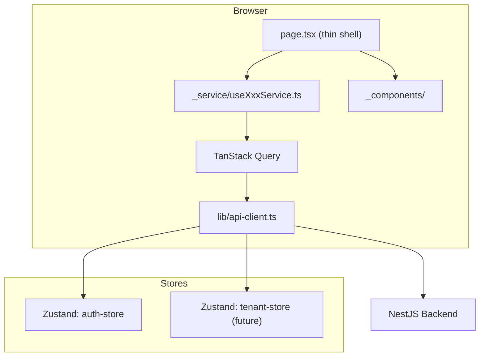
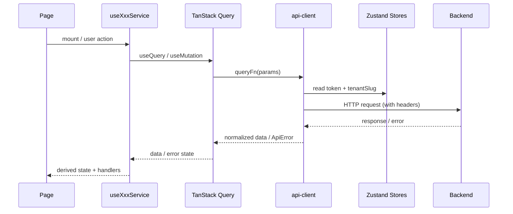
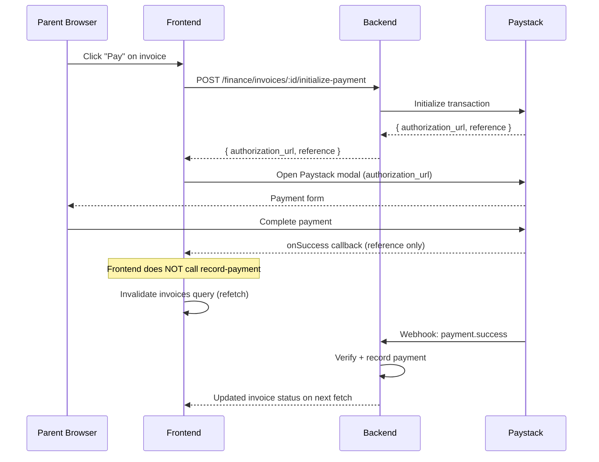

# Design Document: Learnova Frontend Completion

## Overview

This document describes the technical design for completing the Learnova frontend — a multi-tenant
SaaS school management system built with Next.js 16, React 19, TypeScript, TanStack Query v5,
Zustand, React Hook Form + Zod, shadcn/ui, and Tailwind CSS v4.

The work falls into eight areas:
1. API Foundation Layer (centralized client, complete route constants, query key factory)
2. Module service hook wiring (replacing all mock functions with real API calls)
3. Parent Portal pages (`/parent/*`)
4. Student Portal pages (`/student/*`)
5. Notifications Center (`/notifications`)
6. Super Admin stub pages (audit, config)
7. Error/loading boundaries
8. Dark mode toggle + PWA support

The existing pattern — established by the `staff` and `students` modules — is the canonical
reference for all new work. Every new module follows the same shape.

---

## Architecture

### High-Level Component Flow



### Request Lifecycle



---

## Components and Interfaces

### 1. API Foundation Layer

#### `lib/api-client.ts`

The existing `lib/axios-client.ts` already handles cookie-based auth refresh. The new
`api-client.ts` wraps it to add:
- `X-Tenant-Slug` header injection from the tenant context store
- Normalized `ApiError` response interceptor
- Re-export of the axios instance as the single import point for all service hooks

```typescript
// lib/api-client.ts  (conceptual interface)
export interface ApiError {
  statusCode: number;
  message: string;
  errors?: Record<string, string[]>;
}

// The default export is the configured axios instance.
// All service hooks import from here, never from axios directly.
export default apiClient;
```

The tenant slug is read from a new `useTenantStore` (or the existing `useTenant` provider).
Because the axios interceptor runs at request time, it reads the current store value — no
re-initialization needed when the tenant changes.

#### `lib/api-routes.ts` additions

New endpoint groups to append to the existing file:

| Group | Constants |
|---|---|
| `GRADING_ENDPOINTS` | GET_ALL, GET_BY_ID, CREATE, UPDATE, DELETE |
| `ASSESSMENT_ENDPOINTS` | CA_SCORES (GET, SAVE), EXAM_SCORES (GET, SAVE), TIMETABLE (GET, CREATE, UPDATE), EXAMINATIONS (GET, CREATE, UPDATE) |
| `ATTENDANCE_ENDPOINTS` | GET_BY_CLASS_DATE, SAVE, GET_SUMMARY |
| `RESULTS_ENDPOINTS` | GET_CLASS_RESULTS, GET_STUDENT_RESULT, PUBLISH |
| `DISCIPLINE_ENDPOINTS` | GET_ALL, GET_BY_ID, CREATE, UPDATE_STATUS |
| `ADMISSIONS_ENDPOINTS` | GET_ALL, GET_BY_ID, CREATE, UPDATE_STATUS |
| `FINANCE_ENDPOINTS` | INVOICES (CRUD), PAYMENTS (GET, CREATE), LEDGER (GET), FEE_STRUCTURES (CRUD), INIT_PAYMENT |
| `COMMUNICATIONS_ENDPOINTS` | MESSAGES (GET, CREATE, MARK_READ), REPLY |
| `NOTIFICATIONS_ENDPOINTS` | GET_ALL, MARK_READ, MARK_ALL_READ |
| `REPORTS_ENDPOINTS` | ATTENDANCE_TREND, FEE_COLLECTION, PERFORMANCE |
| `AUDIT_ENDPOINTS` | GET_ALL |
| `SUPER_ADMIN_CONFIG_ENDPOINTS` | GET, UPDATE |
| `ASSIGNMENTS_ENDPOINTS` | GET_ALL, CREATE, DELETE |
| `GUARDIAN_ENDPOINTS` | GET_MY_CHILDREN, GET_CHILD_STATS |

#### `app/constants/queryKeys.ts` additions

New keys to add to the existing `queryKeys` object:

```typescript
// additions to existing queryKeys object
GRADING_SYSTEMS: "grading-systems",
ASSESSMENTS_CA: "assessments-ca",
ASSESSMENTS_EXAM: "assessments-exam",
EXAMINATIONS: "examinations",
TIMETABLE: "timetable",
ATTENDANCE: "attendance",
ATTENDANCE_SUMMARY: "attendance-summary",
RESULTS: "results",
DISCIPLINE: "discipline",
ADMISSIONS: "admissions",
INVOICES: "invoices",
PAYMENTS: "payments",
LEDGER: "ledger",
FEE_STRUCTURES: "fee-structures",
MESSAGES: "messages",
NOTIFICATIONS: "notifications",
REPORTS: "reports",
AUDIT_LOGS: "audit-logs",
SUPER_ADMIN_STATS: "super-admin-stats",
SUPER_ADMIN_CONFIG: "super-admin-config",
ASSIGNMENTS: "assignments",
MY_CHILDREN: "my-children",
```

---

### 2. Module Service Hook Pattern

Every module follows the pattern established by `useStaffService` and `useStudentService`.

```
app/(app)/[module]/
  _service/
    use[Module]Service.ts     ← list + mutations
    use[Module]DetailService.ts  ← single record (if needed)
  _components/
    columns.tsx               ← TanStack Table column defs
    [action]-dialog.tsx       ← create/edit/delete dialogs
  page.tsx                    ← thin shell, delegates to service
```

#### Service Hook Template

```typescript
// Pattern: use[Module]Service.ts
const use[Module]Service = () => {
  const queryClient = useQueryClient();
  const [pagination, setPagination] = useState({ page: 1, per_page: 10 });
  const [filters, setFilters] = useState({ search: "", ...moduleFilters });

  const { data, isLoading } = useQuery({
    queryKey: [queryKeys.[MODULE], pagination, filters],
    queryFn: () => apiClient.get(ENDPOINTS.GET_ALL, { params: { ...pagination, ...filters } }),
  });

  const createMutation = useMutation({
    mutationFn: (payload) => apiClient.post(ENDPOINTS.CREATE, payload),
    onSuccess: () => {
      queryClient.invalidateQueries({ queryKey: [queryKeys.[MODULE]] });
      toast.success("Created successfully");
    },
    onError: (err: ApiError) => toast.error(err.message),
  });

  // update, delete mutations follow same shape

  return { data, isLoading, pagination, setPagination, filters, setFilters, createMutation, ... };
};
```

#### Modules to wire (replacing mocks)

| Module | Service Hook | Key Mutations |
|---|---|---|
| Grading Systems | `useGradingService` | create, update, setDefault |
| CA Entry | `useCAService` | saveScores (bulk upsert) |
| Examinations | `useExaminationsService` | create, update |
| Timetable | `useTimetableService` | create, update, delete |
| Attendance | `useAttendanceService` | saveAttendance, getByClassDate |
| Results | `useResultsService` | publish |
| Discipline | `useDisciplineService` | create, updateStatus |
| Admissions | `useAdmissionsService` | updateStatus (approve/reject) |
| Invoices | `useInvoicesService` | create, recordPayment |
| Payments | `usePaymentsService` | create |
| Ledger | `useLedgerService` | (read-only) |
| Fee Structures | `useFeeStructureService` | create, update, delete |
| Messages | `useMessagesService` | create, markRead, reply |
| Notifications | `useNotificationsService` | markRead, markAllRead |
| Reports | `useReportsService` | (read-only, term-scoped) |
| Assignments | `useAssignmentsService` | create, delete |

---

### 3. Parent Portal

New route group: `app/(app)/parent/`

```
app/(app)/parent/
  layout.tsx          ← wraps all parent pages with child selector context
  children/page.tsx
  results/page.tsx
  attendance/page.tsx
  payments/page.tsx
  messages/page.tsx
```

#### Child Selector Context

A `ChildSelectorContext` (React context + provider in `parent/layout.tsx`) holds the currently
selected child ID. All parent portal service hooks read from this context to scope their queries.

```typescript
// Conceptual shape
interface ChildSelectorContext {
  children: Student[];
  selectedChildId: string | null;
  setSelectedChildId: (id: string) => void;
  isLoading: boolean;
}
```

The `useMyChildrenService` hook fetches the guardian's linked children once and populates the
context. All other parent portal hooks depend on `selectedChildId` being non-null.

#### Paystack Payment Flow



The `usePaystackPayment` hook wraps `@paystack/inline-js` (or `react-paystack`):

```typescript
const usePaystackPayment = (invoiceId: string) => {
  const queryClient = useQueryClient();

  const initMutation = useMutation({
    mutationFn: () => apiClient.post(FINANCE_ENDPOINTS.INIT_PAYMENT(invoiceId)),
    onSuccess: ({ data }) => {
      // open Paystack modal with data.authorization_url
      // onClose: invalidate invoices query — do NOT record payment
    },
  });

  return { initiate: initMutation.mutate, isPending: initMutation.isPending };
};
```

---

### 4. Student Portal

New route group: `app/(app)/student/`

```
app/(app)/student/
  results/page.tsx
  attendance/page.tsx
  exams/page.tsx
```

All student portal service hooks read the authenticated student's ID from the auth store
(`useAuthStore().user.id`) — no URL parameter is used for scoping.

---

### 5. Notifications Center

`app/(app)/notifications/page.tsx` with `useNotificationsService`:

- Fetches all notifications for the current user
- Supports filter by type (info, warning, success, error)
- `markRead(id)` mutation → PATCH + invalidate
- `markAllRead()` mutation → PATCH all + invalidate
- Topbar notification badge reads from the same query cache (unread count derived via `filter`)

---

### 6. Super Admin Stub Pages

`app/super-admin/audit/page.tsx` — paginated table of audit log entries from `GET /audit`

`app/super-admin/config/page.tsx` — form pre-populated from `GET /super-admin/config`,
saved via `PATCH /super-admin/config`

Both use the same service hook pattern. The audit page is read-only.

---

### 7. Error and Loading Boundaries

Each major route group gets:

```
app/(app)/loading.tsx          ← full-page skeleton
app/(app)/error.tsx            ← error boundary with reset()
app/super-admin/loading.tsx
app/super-admin/error.tsx
app/onboarding/loading.tsx
app/onboarding/error.tsx
```

Sub-routes that perform data fetching (e.g. `finance/invoices/`) get their own `loading.tsx`
with a layout-matching skeleton (table skeleton for list pages, card skeleton for detail pages).

The `error.tsx` components display the `ApiError.message` when available:

```typescript
"use client";
export default function ErrorPage({ error, reset }: { error: Error; reset: () => void }) {
  const apiError = error as ApiError;
  return (
    <div className="flex flex-col items-center gap-4 p-8">
      <p>{apiError?.message ?? "Something went wrong"}</p>
      <Button onClick={reset}>Try Again</Button>
    </div>
  );
}
```

---

### 8. Dark Mode + PWA

#### Dark Mode

`next-themes` is already a dependency. Changes needed:
1. Wrap `app/layout.tsx` with `<ThemeProvider attribute="class" defaultTheme="system" enableSystem>`
2. Add a `DarkModeToggle` button to `components/layout/topbar.tsx` using `useTheme()` from
   `next-themes` — toggles between `"light"` and `"dark"`, persisted to `localStorage` by
   `next-themes` automatically.

#### PWA

1. `public/manifest.json` — name, short_name, icons (192×192, 512×512), theme_color,
   background_color, display: "standalone", start_url: "/"
2. `public/sw.js` — service worker with:
   - Cache-first for static assets (`/_next/static/`, `/icons/`)
   - Network-first for API requests (`/api/`, `NEXT_PUBLIC_API_URL`)
   - Offline fallback page at `/offline`
3. Register SW in `app/layout.tsx` via a `<Script>` tag or a `useEffect` in a client component

---

## Data Models

All data models are already defined in `types/index.ts`. The design adds no new types — it
wires existing types to real API endpoints.

New additions to `types/index.ts`:

```typescript
// Normalized API error shape (from api-client.ts)
export interface ApiError {
  statusCode: number;
  message: string;
  errors?: Record<string, string[]>;
}

// Fee structure (missing from current types)
export interface FeeStructure {
  id: string;
  name: string;
  description: string;
  amount: number;
  applicableClasses: string[]; // classLevel IDs, empty = all
  termId: string;
  isActive: boolean;
}

// Subject-Teacher-Class assignment
export interface SubjectAssignment {
  id: string;
  subjectId: string;
  subjectName: string;
  teacherId: string;
  teacherName: string;
  classArmId: string;
  classArmName: string;
}

// Paystack init response
export interface PaystackInitResponse {
  authorizationUrl: string;
  reference: string;
  accessCode: string;
}

// Report data shapes
export interface AttendanceTrendPoint { date: string; rate: number; }
export interface FeeCollectionPoint { className: string; collected: number; outstanding: number; }
export interface PerformancePoint { grade: string; count: number; }
export interface ReportData {
  attendanceTrend: AttendanceTrendPoint[];
  feeCollection: FeeCollectionPoint[];
  performance: PerformancePoint[];
  stats: { avgAttendance: number; feeRecovery: number; passRate: number; };
}
```

---

## Correctness Properties

*A property is a characteristic or behavior that should hold true across all valid executions
of a system — essentially, a formal statement about what the system should do. Properties serve
as the bridge between human-readable specifications and machine-verifiable correctness guarantees.*

### Property 1: API Client Header Injection

*For any* auth token value T stored in the Zustand auth store and any tenant slug S stored in
the tenant context store, every HTTP request dispatched through `api-client.ts` must contain
`Authorization: Bearer T` and `X-Tenant-Slug: S` in its headers, regardless of HTTP method,
endpoint, or request body.

**Validates: Requirements 1.2, 1.3, 1.7**

### Property 2: Error Response Normalization

*For any* HTTP response with a 4xx or 5xx status code received by `api-client.ts`, the
resulting thrown error must be an `ApiError` object with a numeric `statusCode`, a non-empty
`message` string, and an optional `errors` field — never a raw `AxiosError` or unstructured
object.

**Validates: Requirements 1.5**

### Property 3: Cache Invalidation After Mutations

*For any* resource R with list query key K, after a successful create, update, or delete
mutation on R, a subsequent read of K must return a list that reflects the mutation (new record
present, updated record changed, deleted record absent). This must hold for all resources:
grading systems, assessments, attendance, results, invoices, payments, fee structures,
discipline incidents, admissions, messages, and notifications.

**Validates: Requirements 2.1, 2.2**

### Property 4: Result Score Computation Invariant

*For any* `TermResult` record R returned by the backend, the `totalScore` displayed for each
subject S must equal the sum of all `caScores[i].score` values for S plus `examScore` for S.
Additionally, the letter grade displayed for S must be the grade band from the active
`GradingSystem` where `minScore <= subjectTotalScore <= maxScore`.

**Validates: Requirements 7.3**

### Property 5: Finance Stats Invariant

*For any* set of `Invoice` records I fetched from the backend:
- `displayed_total_revenue` must equal `sum(i.paidAmount for i in I)`
- `displayed_outstanding` must equal `sum(i.balance for i in I where i.status in ['unpaid', 'partial', 'overdue'])`

*For any* set of `LedgerEntry` records T:
- `displayed_net_flow` must equal `sum(t.amount for t in T where t.type == 'credit') - sum(t.amount for t in T where t.type == 'debit')`

**Validates: Requirements 9.3, 9.9**

### Property 6: Parent Portal Data Isolation

*For any* authenticated Guardian G, every piece of data rendered in the Parent Portal
(results, attendance, invoices, messages) must belong exclusively to students S where
`S.guardians` contains a record with `userId == G.userId`. No other student's data may appear
in the Parent Portal regardless of URL parameters or query string manipulation.

**Validates: Requirements 12.3, 13.5, 14.4, 15.6**

### Property 7: Student Portal Data Isolation

*For any* authenticated Student U, every piece of data rendered in the Student Portal
(results, attendance, exam timetable) must have `studentId == U.id`. No other student's data
may be accessible from the Student Portal regardless of URL manipulation.

**Validates: Requirements 18.8**

### Property 8: Paystack Payment Integrity

*For any* payment flow initiated from the Parent Portal, the frontend must call the backend
initialize-payment endpoint to obtain an authorization URL, open the Paystack modal with that
URL, and — after the modal closes — must NOT call any record-payment or mark-paid endpoint.
The invoice status must only change after the backend processes the Paystack webhook. A
subsequent refetch of the invoice list after modal close must reflect the backend's authoritative
payment status, not any frontend-assumed status.

**Validates: Requirements 15.3, 15.4, 15.5**

### Property 9: Notification Unread Count Invariant

*For any* authenticated user U with notification set N:
- `displayed_unread_count` must equal `count(n in N where n.isRead == false)`
- After marking notification n as read: `new_unread_count` must equal `old_unread_count - 1`
- After marking all notifications as read: `new_unread_count` must equal `0`

These invariants must hold for any arbitrary number of notifications and any sequence of
mark-read operations.

**Validates: Requirements 20.3, 20.4, 20.7**

### Property 10: Duplicate Assignment Prevention

*For any* pair (subjectId, classArmId), the system must reject a second assignment creation
attempt for that pair and display a validation error. The assignment list must remain unchanged
after a rejected duplicate attempt.

**Validates: Requirements 11.4**

### Property 11: Theme Persistence Round-Trip

*For any* theme value T selected by the user (light or dark), after a page reload the active
theme must equal T, as read from `localStorage` by `next-themes`. This must hold regardless
of the user's OS color scheme preference.

**Validates: Requirements 24.2**

---

## Error Handling

### API Error Handling Strategy

All errors flow through `api-client.ts`'s response interceptor, which normalizes them into
`ApiError`. Service hooks catch errors in `onError` callbacks and call `toast.error()` with
`err.message`. Form mutations additionally set form-level errors via `form.setError("root", ...)`.

```
Backend error → AxiosError → api-client interceptor → ApiError
  → useMutation onError → toast.error(message)
  → (form mutations) → form.setError("root") → displayed in dialog
```

### 401 Refresh Flow

The existing `axios-client.ts` already handles 401 → refresh → retry with a queue for
concurrent requests. `api-client.ts` wraps this instance, so the behavior is inherited.

### Empty States

Pages that depend on backend stubs (assessment, attendance, results, discipline, admissions)
use the existing `EmptyState` shared component when the API returns an empty array. This
prevents crashes and gives users a clear signal that data is not yet available.

### Loading States

- List pages: `DataTable` with `isLoading` prop renders skeleton rows
- Detail/form pages: `Skeleton` components matching the page layout
- Route-level: `loading.tsx` files render full-page skeletons during navigation

---

## Testing Strategy

### Dual Testing Approach

Both unit tests and property-based tests are required. They are complementary:
- Unit tests catch concrete bugs in specific scenarios and edge cases
- Property tests verify universal correctness across all possible inputs

### Property-Based Testing

**Library**: `fast-check` (TypeScript-native, works with Vitest)

**Configuration**: Each property test runs a minimum of 100 iterations.

**Tag format**: `// Feature: learnova-frontend-completion, Property N: <property_text>`

Each correctness property from the design maps to exactly one property-based test:

| Property | Test file | fast-check arbitraries |
|---|---|---|
| P1: Header Injection | `api-client.test.ts` | `fc.string()` for token + slug |
| P2: Error Normalization | `api-client.test.ts` | `fc.integer({min:400,max:599})` for status codes |
| P3: Cache Invalidation | `cache-invalidation.test.ts` | `fc.oneof(...)` for resource types |
| P4: Result Score Computation | `results.test.ts` | `fc.array(fc.float({min:0,max:100}))` for scores |
| P5: Finance Stats Invariant | `finance-stats.test.ts` | `fc.array(fc.record({paidAmount, balance, status}))` |
| P6: Parent Portal Isolation | `parent-isolation.test.ts` | `fc.array(fc.record({guardianId, studentId}))` |
| P7: Student Portal Isolation | `student-isolation.test.ts` | `fc.string()` for student IDs |
| P8: Paystack Integrity | `paystack.test.ts` | `fc.record({invoiceId, amount})` |
| P9: Notification Count | `notifications.test.ts` | `fc.array(fc.boolean())` for isRead values |
| P10: Duplicate Assignment | `assignments.test.ts` | `fc.tuple(fc.string(), fc.string())` for (subjectId, classArmId) |
| P11: Theme Persistence | `theme.test.ts` | `fc.constantFrom("light", "dark")` |

### Unit Tests

Unit tests focus on:
- Specific examples: grading system CRUD, invoice creation, attendance save
- Integration points: service hook → api-client → query cache
- Edge cases: empty invoice list (stats = 0), unpublished results (portal shows message)
- Error conditions: 401 triggers refresh, 422 shows form error, network error shows toast

**Avoid**: Writing unit tests that duplicate what property tests already cover (e.g. don't
write 10 unit tests for different invoice combinations when the finance stats property test
covers all combinations).

### Test File Organization

```
__tests__/
  api-client.test.ts
  cache-invalidation.test.ts
  results.test.ts
  finance-stats.test.ts
  parent-isolation.test.ts
  student-isolation.test.ts
  paystack.test.ts
  notifications.test.ts
  assignments.test.ts
  theme.test.ts
```
