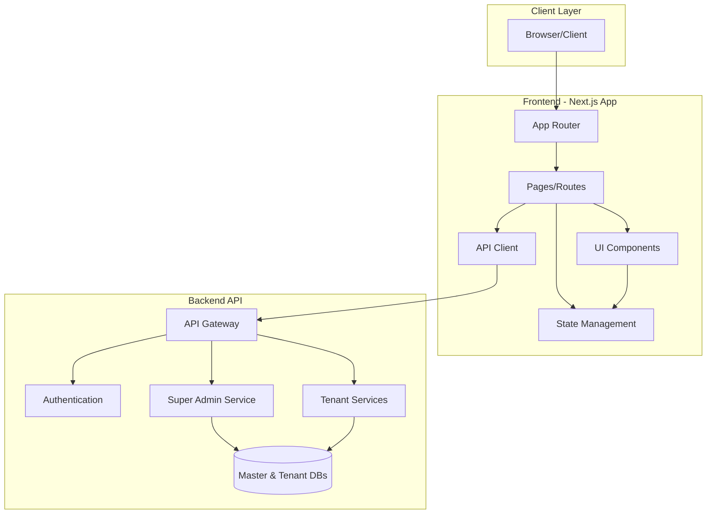
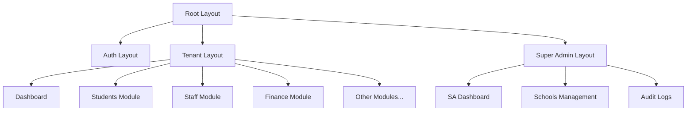
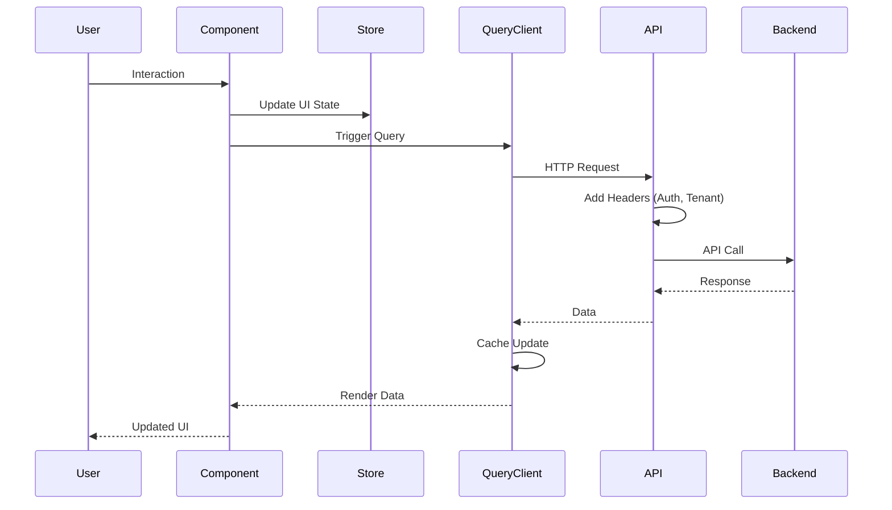
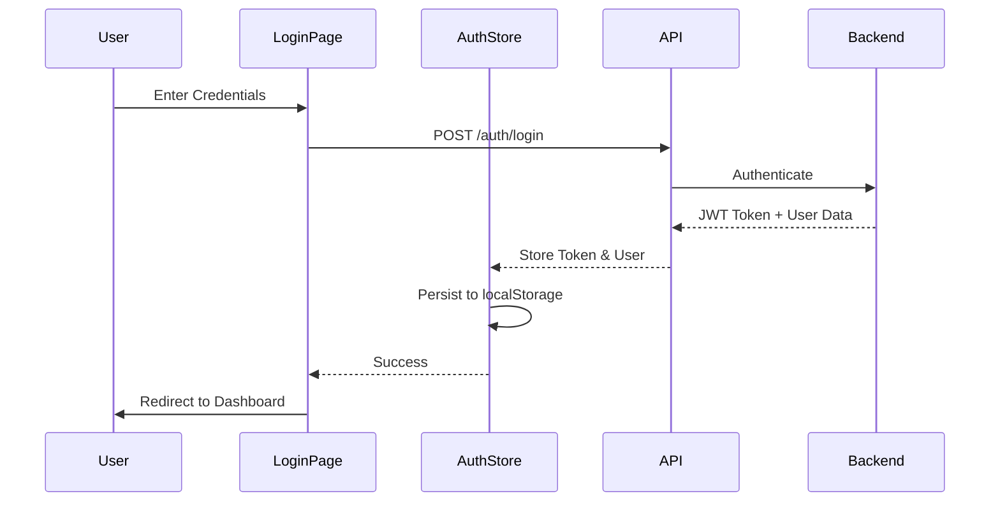
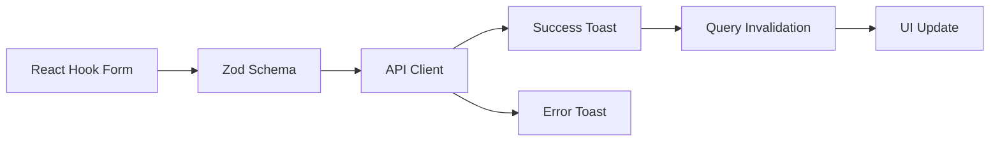

# School Management System - Architecture

## Overview

The School Management System is a modern, multi-tenant web application built with Next.js that provides comprehensive tools for managing educational institutions. This document outlines the system architecture, design patterns, and technical implementation details.

## System Architecture

### High-Level Architecture



## Frontend Architecture

### Technology Stack

#### Core Framework

- **Next.js 16** with App Router for modern React architecture
- **React 19** with Server Components and Client Components
- **TypeScript** for type safety and better developer experience

#### State Management Strategy

The application uses a layered state management approach:

| State Type   | Tool            | Use Case                              |
| ------------ | --------------- | ------------------------------------- |
| Server State | TanStack Query  | API data, caching, background updates |
| Client State | Zustand         | UI state, user preferences, drafts    |
| URL State    | Next.js Router  | Navigation, filters, pagination       |
| Form State   | React Hook Form | Form data, validation                 |

#### UI Architecture



### Directory Structure Explained

#### `/app` - App Router Structure

Next.js App Router uses file-system based routing with special conventions:

- **Route Groups**: `(folder)` - Groups routes without affecting URLs
  - `(auth)` - Authentication pages
  - `(tenant)` - Main application for school tenants
- **Dynamic Routes**: `[param]` - Dynamic route segments
- **Special Files**:
  - `layout.tsx` - Shared UI for route segments
  - `page.tsx` - Route UI
  - `loading.tsx` - Loading UI
  - `error.tsx` - Error UI

#### `/components` - Component Architecture

```
components/
├── ui/              # shadcn/ui primitives (buttons, inputs, etc.)
├── layout/          # Layout components (sidebar, header, footer)
└── shared/          # Shared business components
```

**Component Design Principles**:

- Atomic design methodology
- Composition over inheritance
- Props-based customization
- Accessibility-first approach

#### `/lib` - Core Utilities

```
lib/
├── api/             # API client and HTTP utilities
├── stores/          # Zustand state stores
├── utils.ts         # General utilities (cn, formatters)
├── format.ts        # Data formatting helpers
└── navigation.ts    # Navigation configuration
```

#### `/hooks` - Custom React Hooks

Custom hooks encapsulate reusable logic:

- `use-mobile.ts` - Responsive design hook
- `use-offline.ts` - Offline detection and sync
- `use-permission.tsx` - Permission-based UI rendering
- `use-toast.ts` - Toast notification system

### State Management Details

#### Zustand Stores

**Auth Store** (`auth-store.ts`)

```typescript
interface AuthStore {
  user: User | null;
  tenantId: string | null;
  token: string | null;
  login: (credentials) => Promise<void>;
  logout: () => void;
}
```

**UI Store** (`ui-store.ts`)

```typescript
interface UIStore {
  sidebarOpen: boolean;
  theme: "light" | "dark" | "system";
  toggleSidebar: () => void;
  setTheme: (theme) => void;
}
```

**Draft Store** (`draft-store.ts`)

```typescript
interface DraftStore {
  drafts: Map<string, any>;
  saveDraft: (key, data) => void;
  loadDraft: (key) => any;
  clearDraft: (key) => void;
}
```

#### TanStack Query Usage

Server state management with automatic caching and revalidation:

```typescript
// Example: Fetching students
const { data, isLoading, error } = useQuery({
  queryKey: ["students", filters],
  queryFn: () => fetchStudents(filters),
  staleTime: 5 * 60 * 1000, // 5 minutes
});
```

### Routing Architecture

#### Multi-Tenant Routing

The application uses a dual routing strategy:

1. **Super Admin Routes**: `/super-admin/*`
   - Access: Super admin users only
   - Purpose: Manage all tenants, system configuration
2. **Tenant Routes**: `/(tenant)/*`
   - Access: School administrators, teachers, parents, students
   - Scope: Single tenant (school) data
   - Tenant isolation via `X-Tenant-ID` header

3. **Auth Routes**: `/(auth)/*`
   - Access: Public
   - Purpose: Login, signup, password reset

#### Navigation Configuration

Navigation is centrally configured in `lib/navigation.ts`:

```typescript
export const tenantNav = [
  {
    title: "Dashboard",
    href: "/dashboard",
    icon: Home,
    permission: "dashboard.view",
  },
  // ... more routes
];
```

### Component Patterns

#### Server Components (RSC)

Used for:

- Layouts
- Static content
- Data fetching (when no interactivity needed)
- SEO-critical pages

```typescript
// app/students/page.tsx
export default async function StudentsPage() {
  const students = await fetchStudents(); // Server-side fetch
  return <StudentList students={students} />;
}
```

#### Client Components

Used for:

- Interactive UI elements
- State management
- Event handlers
- Browser APIs

```typescript
"use client";

export function StudentForm() {
  const [name, setName] = useState("");
  // ... interactive logic
}
```

### Styling Architecture

#### TailwindCSS Configuration

- **Base Layer**: Global styles, CSS reset
- **Components Layer**: Reusable component classes
- **Utilities Layer**: Utility classes

#### Theme System

CSS variables for dynamic theming:

```css
:root {
  --background: 0 0% 100%;
  --foreground: 222.2 84% 4.9%;
  --primary: 222.2 47.4% 11.2%;
  /* ... */
}

.dark {
  --background: 222.2 84% 4.9%;
  --foreground: 210 40% 98%;
  /* ... */
}
```

#### Component Variants

Using `class-variance-authority` for type-safe variants:

```typescript
const buttonVariants = cva(
  "inline-flex items-center justify-center rounded-md",
  {
    variants: {
      variant: {
        default: "bg-primary text-primary-foreground",
        outline: "border border-input",
      },
      size: {
        default: "h-10 px-4 py-2",
        sm: "h-9 px-3",
        lg: "h-11 px-8",
      },
    },
  },
);
```

## Data Flow

### Request Flow



### Authentication Flow



### Multi-Tenant Data Isolation

Every API request includes tenant context:

```typescript
// API Interceptor
apiClient.interceptors.request.use((config) => {
  const { token, tenantId } = useAuthStore.getState();

  if (token) {
    config.headers.Authorization = `Bearer ${token}`;
  }

  if (tenantId) {
    config.headers["X-Tenant-ID"] = tenantId;
  }

  return config;
});
```

## Security Architecture

### Authentication

- **JWT-based authentication**
- Token stored in memory and localStorage
- Automatic token refresh
- Secure HTTP-only cookies (recommended for production)

### Authorization

#### Role-Based Access Control (RBAC)

Roles hierarchy:

1. Super Admin - Full system access
2. School Admin - Full school tenant access
3. Teacher - Limited to assigned classes
4. Parent - Limited to their children's data
5. Student - Read-only access to own data

#### Permission Checking

```typescript
// hooks/use-permission.tsx
export function usePermission(permission: string) {
  const { user } = useAuthStore();
  return user?.permissions.includes(permission) ?? false;
}

// Usage in component
function StudentActions() {
  const canEdit = usePermission('students.edit');

  return canEdit ? <EditButton /> : null;
}
```

### Data Security

- All API calls over HTTPS
- XSS prevention via React's automatic escaping
- CSRF protection for state-changing requests
- Content Security Policy (CSP) headers

## Performance Optimization

### Code Splitting

- **Automatic Route-based Splitting**: Next.js automatically splits by route
- **Dynamic Imports**: Heavy components loaded on-demand

```typescript
const HeavyChart = dynamic(() => import('./HeavyChart'), {
  loading: () => <Skeleton />,
});
```

### Caching Strategy

#### Next.js Caching Layers

1. **Request Memoization**: Same request deduped in single render
2. **Data Cache**: Persistent across requests (ISR)
3. **Full Route Cache**: Cached rendered routes
4. **Router Cache**: Client-side navigation cache

#### TanStack Query Cache

- **Stale Time**: Data fresh for 5 minutes
- **Cache Time**: Unused data garbage collected after 5 minutes
- **Background Refetch**: Automatic revalidation on window focus

### Image Optimization

- Next.js Image component with automatic optimization
- WebP format with PNG/JPEG fallback
- Responsive images with `srcset`
- Lazy loading with intersection observer

### Bundle Optimization

- Tree shaking for unused code elimination
- Minification and compression
- Environment-specific builds

## Offline Support

### Service Worker Strategy

The `use-offline.ts` hook provides:

- Offline detection
- Request queuing
- Background sync when connection restored

```typescript
const { isOffline, queueRequest } = useOffline();

if (isOffline) {
  queueRequest(requestData);
} else {
  sendRequest(requestData);
}
```

## Form Handling

### Form Architecture



### Validation Strategy

```typescript
// schemas/student.schema.ts
export const studentSchema = z.object({
  firstName: z.string().min(1, "First name is required"),
  lastName: z.string().min(1, "Last name is required"),
  dateOfBirth: z.date(),
  email: z.string().email(),
});

// Form usage
const form = useForm({
  resolver: zodResolver(studentSchema),
  defaultValues: draft || initialValues,
});
```

### Draft Auto-save

Forms automatically save to local storage:

```typescript
useEffect(() => {
  const subscription = form.watch((data) => {
    saveDraft("student-form", data);
  });
  return () => subscription.unsubscribe();
}, [form.watch]);
```

## Error Handling

### Error Boundaries

- Route-level error boundaries (`error.tsx`)
- Component-level error boundaries for isolated failures
- Fallback UI for graceful degradation

### API Error Handling

```typescript
// Global error handler
apiClient.interceptors.response.use(
  (response) => response,
  (error) => {
    if (error.response?.status === 401) {
      // Redirect to login
      authStore.logout();
    }

    if (error.response?.status === 403) {
      // Show permission denied
      toast.error("Permission denied");
    }

    return Promise.reject(error);
  },
);
```

## Testing Strategy

### Planned Testing Approach

1. **Unit Tests**: Utilities, hooks, and pure functions
2. **Component Tests**: UI components with React Testing Library
3. **Integration Tests**: User flows across multiple components
4. **E2E Tests**: Critical user journeys with Playwright

## Build & Deployment

### Build Process

```bash
npm run build
```

Steps:

1. TypeScript compilation (currently with errors ignored)
2. Next.js build (static generation + SSR routes)
3. Asset optimization
4. Bundle analysis

### Environment Configuration

| Environment | Purpose                | Settings                         |
| ----------- | ---------------------- | -------------------------------- |
| Development | Local development      | Source maps, hot reload          |
| Staging     | Pre-production testing | Production build, test data      |
| Production  | Live system            | Optimized, analytics, monitoring |

### Deployment Platforms

**Recommended: Vercel**

- Zero-config deployment
- Automatic HTTPS
- Edge network CDN
- Analytics integration

**Alternative: Docker**

```dockerfile
FROM node:18-alpine
WORKDIR /app
COPY package*.json ./
RUN npm ci --only=production
COPY . .
RUN npm run build
EXPOSE 3000
CMD ["npm", "start"]
```

## Monitoring & Analytics

### Analytics Integration

- **@vercel/analytics**: Web vitals, performance metrics
- Custom event tracking for user interactions

### Performance Monitoring

Track:

- Page load times
- API response times
- Error rates
- User engagement metrics

## Future Enhancements

### Planned Features

1. **Progressive Web App (PWA)**
   - Offline-first architecture
   - Install to home screen
   - Push notifications

2. **Real-time Updates**
   - WebSocket integration
   - Live notifications
   - Collaborative editing

3. **Advanced Caching**
   - Service worker caching
   - IndexedDB for offline data
   - Optimistic UI updates

4. **Internationalization (i18n)**
   - Multi-language support
   - RTL layout support
   - Locale-specific formatting

## Best Practices

### Code Organization

1. **Colocation**: Keep related files together
2. **Single Responsibility**: One component, one purpose
3. **DRY**: Extract reusable logic into hooks
4. **Type Safety**: Leverage TypeScript fully

### Performance

1. **Lazy Load**: Load heavy components on demand
2. **Memoization**: Use `useMemo` and `useCallback` wisely
3. **Virtualization**: For long lists (e.g., TanStack Virtual)
4. **Debounce**: For search and filters

### Accessibility

1. **Semantic HTML**: Use proper HTML elements
2. **ARIA Labels**: For screen readers
3. **Keyboard Navigation**: All interactive elements accessible via keyboard
4. **Color Contrast**: WCAG AA compliance

### Security

1. **Sanitize Input**: Validate all user input
2. **Least Privilege**: Minimal permissions required
3. **Secure Headers**: CSP, X-Frame-Options, etc.
4. **Dependency Updates**: Regular security patches

## Troubleshooting

### Common Issues

**Issue**: Hydration errors

- **Cause**: Server/client content mismatch
- **Solution**: Ensure consistent rendering, use `useEffect` for client-only code

**Issue**: Slow page loads

- **Cause**: Large bundles or unoptimized images
- **Solution**: Code splitting, image optimization, lazy loading

**Issue**: Authentication errors

- **Cause**: Token expiration
- **Solution**: Implement token refresh mechanism

## Conclusion

This architecture provides a solid foundation for a scalable, maintainable, and performant school management system. The modular design allows for easy feature additions and modifications while maintaining code quality and user experience.

---

**Last Updated**: February 2026  
**Version**: 1.0
